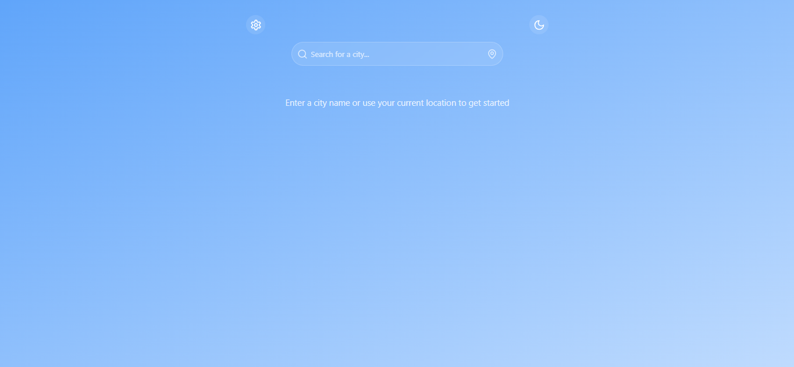

# 🌤️ Modern Weather App

<div align="center">


[](https://opensource.org/licenses/MIT)
[](http://makeapullrequest.com)

</div>

<div align="center">
  
</div>

## ✨ Overview

A beautiful and feature-rich weather application built with React and TypeScript that provides real-time weather information and forecasts. Experience weather data like never before with our intuitive interface and comprehensive features.

## 🌟 Key Features

<div align="center">

| 🎯 Feature | 📝 Description |
|------------|---------------|
| 🌍 **Real-time Weather** | Get current weather conditions for any location worldwide |
| 📅 **7-Day Forecast** | View detailed weather forecasts for the upcoming week |
| 🔍 **Smart Search** | Search for any city or location with instant results |
| 📍 **Geolocation** | Get weather for your current location with one click |
| 🌡️ **Unit Toggle** | Switch between Celsius and Fahrenheit |
| 🌓 **Theme Support** | Toggle between dark and light themes |
| ⚠️ **Weather Alerts** | Receive important weather warnings and alerts |
| 📊 **Detailed Info** | Comprehensive weather data including temperature, wind, humidity, and more |

</div>

### 📊 Weather Information Includes:
- 🌡️ Temperature
- 💨 Wind speed
- 💧 Humidity
- 🌧️ Precipitation
- ☀️ UV index
- 🌅 Sunrise/Sunset times
- 📱 Responsive design for all devices
- 🔄 Recent searches history

## 🛠️ Tech Stack

<div align="center">

| Category | Technologies |
|----------|--------------|
| **Frontend** | React, TypeScript, Tailwind CSS |
| **APIs** | Open-Meteo API |
| **Icons** | Lucide Icons |
| **Utilities** | date-fns |

</div>

## 🚀 Quick Start

### Prerequisites

- Node.js (v14 or higher)
- npm or yarn

### Installation

```bash
# Clone the repository
git clone https://github.com/yourusername/weather-app.git
cd weather-app

# Install dependencies
npm install
# or
yarn install

# Start the development server
npm run dev
# or
yarn dev
```

Visit [http://localhost:3000](http://localhost:3000) to see the app in action! 🎉

## 📱 How to Use

1. 🔍 **Search for a Location**
   - Enter a city name in the search bar
   - Or use the geolocation button for your current location

2. ⚙️ **Customize Your Experience**
   - Toggle between Celsius and Fahrenheit
   - Switch between dark and light themes
   - View detailed weather information

3. 📊 **Explore Weather Data**
   - Check current conditions
   - View 7-day forecast
   - Monitor weather alerts

## 🔧 Configuration

The app uses the Open-Meteo API for weather data. No API key is required as it's a free and open API.

## 🤝 Contributing

We love your input! We want to make contributing to this project as easy and transparent as possible.

1. Fork the repository
2. Create your feature branch (`git checkout -b feature/AmazingFeature`)
3. Commit your changes (`git commit -m 'Add some AmazingFeature'`)
4. Push to the branch (`git push origin feature/AmazingFeature`)
5. Open a Pull Request

## 📝 License

This project is licensed under the MIT License - see the [LICENSE](LICENSE) file for details.

## 🙏 Acknowledgments

- Weather data provided by [Open-Meteo](https://open-meteo.com/)
- Icons by [Lucide](https://lucide.dev/)

---

<div align="center">
Made with ❤️ by [Your Name]
</div> 